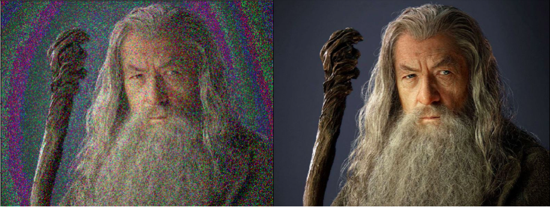

# Error correcting codes for Images (Sophomore undergrad project)

### This is an old repo that is probably outdated 

Using two different methods (Hamming and BCH) to correct potential transmitted errors on images. 

See an example of obstructed data and corrected on Gandalf:

I used a gandalf picture in which I introduced random errors which were then detected and corrected by both BCH and Hamming algorithms. 

You have also access to a comparison of the computed time of both algorithms in function of the size of a picture. 
